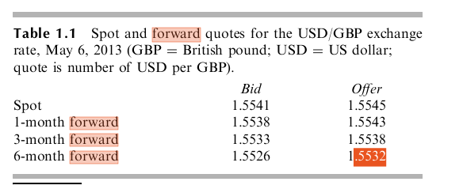
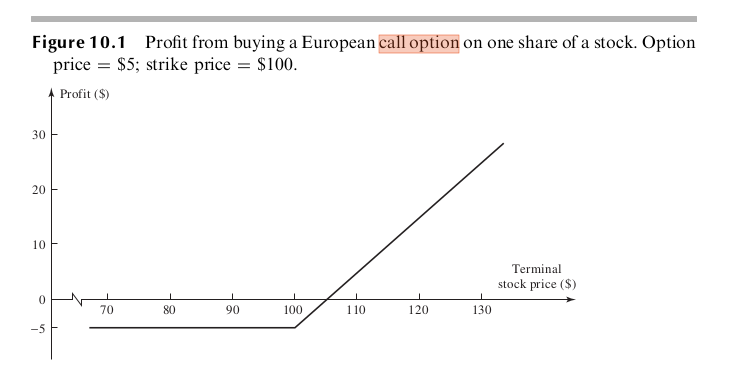
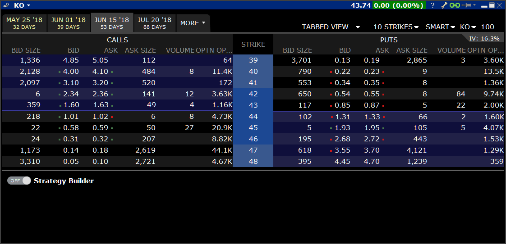
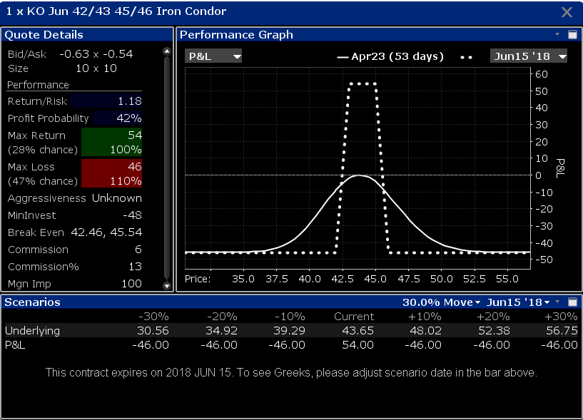

```{r setup, include=FALSE}
knitr::opts_chunk$set(echo = FALSE)
library(quantmod)
getSymbols("AAPL")
```


## Last class

Last class we learned about different types of financial instruments. 

There are also **derivatives** that you can trade. 

The price of derivatives go up and down randomly, but their value is tied to an **underlying** asset. 

Speculators use these to gamble on the future, corporations and investors can use them to hedge/mitigate risk, and dealers can sell them and hedge their risk to make commissions.


## Futures and Forwards

A **forward contract** is an agreement to buy or sell an asset at a certain time in the future at a certain price. 

If you buy a forward contract, you agree to buy the underlying on the future date. 

If you sell a forward contract, you agree to sell the underlying on the future date.

At any given moment, the forward price should "sort of close" to the *spot* price.


## Futures and Forwards

You work at a company, and you know you'll need $\textsterling$ 1 million in 6 months. If you want to lock in a price now, how much money will you need?

```{r, out.width = "300px"}

```


## Futures and Forwards

**Futures** contracts are similar to forwards. 

Forwards are more bespoke OTC contracts between two parties (i.e. between an investment bank and its client). 

Futures are more standardized, and trade more actively on exchanges. You can buy and sell futures very quickly and cheaply in your brokerage account.

There are futures on oil, agricultural products, financial indexes and much more. 


## Futures and Forwards

Let's consider single stock futures. 

Suppose the current stock price is $S_0$, the risk free interest rate is $r$, and the exercise date is $t$ days away from now.

The **fair value** of a future $f$ is

$$
f = S_0(1 + r \frac{t}{360}) - D
$$

where $D$ is the value of dividends you would receive before the exercise date.

This is the value of the stock in the future. $S_0$ dollars now is worth $S_0(1 + r \frac{t}{360})$ in the future, and if you don't have the stock until later, you'll miss out on dividend payments.

## Futures and Forwards


Why does this have to be very close to reality? 

If $f < S_0(1 + r \frac{t}{360}) - D$, then buy $k$ futures contracts for $f$ and sell $k$ shares of stock for $S_0$. 

At future time $t$, if you take delivery on the futures contract,

  - receive $k S_t$ value of stock
  - futures profit(loss) is $k(S_t - f) > k[S_t - S_0(1 + r \frac{t}{360}) + D]$
  - stock position profit(loss) is $-k(S_t + D - S_0)$
  
Total profit is at least $k[S_t - S_0(1 + r \frac{t}{360}) + D] -k(S_t + D - S_0)  = kS_0(r\frac{t}{360})$.


## Futures and Forwards


This is an **arbitrage** opportunity. It's riskless profit.

You can write a program that continuously checks that the futures price is inline with the underlying stock/stock index.

If it isn't, instantly enter into the riskless trade and make money. 


## Futures and Forwards


So $f \approx S_0(1 + r \frac{t}{360}) - D$. It's basically buying the stock without receiving the dividends. It moves around the same way as a stock. 

If you aren't trying to capture arbitrage opportunities, you might trade futures instead of stocks/ETFs because of some of the contract advantages:

  - tax considerations,
  - more leverage, or
  - different trading hours

For futures on **commodities**, the futures price deviates from the spot price more wildly, and people often trade the difference between these two (i.e. **basis trading.**)

## Derivatives

If you're a dealer of derivatives, you need to think carefully about how the value of derivatives are related to the underlying assets. 

If you don't, you will provide **arbitrage** opportunities to other people, and you will lose money. 

That's why people who sell derivatives are interested in **derivatives pricing.** 

This isn't exactly a statistical pursuit because this does not involve parameter/model estimation using historical data. We are not necessarily trying to forecast the future, either. It's coming up with mathematical relationships between derivatives and the underlying assets. 


## Options

**European call options** are contracts that allow the buyer to buy a fixed amount of shares at a fixed price on a fixed date in the future. 

**European Put options** are contracts that allow the buyer to sell a fixed amount of shares at a fixed price on a fixed date in the future.

**American call options** are contracts that allow the buyer to buy a fixed amount of shares at a fixed price at any time before the expiration date. 

**American Put options** are contracts that allow the buyer to sell a fixed amount of shares at a fixed price at any time before the expiration date.


## Options

The payoff of a European call: $\max(S_T - K, 0)$

```{r, out.width = "300px"}

```


## Options

Speculators can take positions in options contracts. There's more leverage, you can cap your downside, and you can skew payouts. 

Investors can use them to augment their stock positions (e.g. selling covered calls, or buying puts as downside protection). 

Market makers can sell puts and calls and make commissions, but they need to be careful to hedge their exposure in the underlying (e.g. using the Black-Scholes model).


## Options

**Put-call parity** provides a relationship between European put, European calls and futures **at any point in time**:

$$
C_t - P_t = S_t - e^{-r[T-t]}K
$$

  - If $S_T > K$, the long call pays $S_T-K$, and the short put expires worthless.
  - If $S_T < K$ the long call expires worthless, and the short loses $K -S_T$
  - So the payoff of left hand side in the future is always $S_T-K$.
  - The right hand side is invest \$ $S_t$ in the stock and sell a zero-coupon bond that pays $K$ at maturity
  - The payoff for this strategy is $S_T-K$ as well!
  

## Options

```{r, out.width = "300px"}

```


## Options

Arbitrage opportunities implied by deviation from this relationship are difficult to take advantage of. 

You have to buy and sell two option legs, sell a bond, and buy stock. 

One of the option legs will be less liquid than the other, and the bid-ask spread and commissions in options can be quite large. 

Later we'll discuss the Black-Scholes equation, which implies a more useful hedging/arbitrage strategy!

But again, this stuff isn't really statistics :(

We're not estimating things from data here.

## Options

On the other hand let's suppose we're not market makers. We're forecasters.

We want to trade as few times as possible once (trading is expensive). 

We have access to a probabilistic forecast for the future.


## Options

People can buy/sell $\ge 2$ options in conjunction. 

E.g. spreads, strangles, straddles, butterflies, condors, etc.

```{r, out.width = "300px"}

```