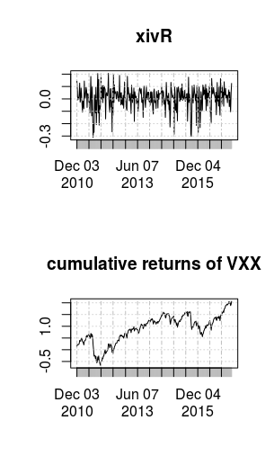

```{r setup, include=FALSE}
knitr::opts_chunk$set(echo = FALSE)
library(xts)
```


## Last class

Last class we previewed some examples of univariate time series models. 

  - AR(1): $X_t - \phi X_{t-1} = Z_t$
  - MA(1): $X_t = Z_t + \theta Z_{t-1}$

Now we'll explore how to TODO


## Linear Processes

Before we define linear processes, we define $B$: **the backshift operator** 

$$
B Y_t = Y_{t-1}
$$

We will take a complex polynomial, and think of it as a function of the backshift operator.

For example: 

$$\psi(z) = 1 + \psi z + \psi_2 z^2 + \cdots $$
$$\psi(B) = 1 + \psi B + \psi_2 B^2 + \cdots $$


## Linear Processes


The time series $\{X_t\}$ is a **linear process** if it has the representation
\[
X_t = \sum_{j=-\infty}^{\infty} \psi_j Z_{t-j},
\]
for all $t \in \mathbb{Z}$, where $Z_t \sim \text{WN}(0,\sigma^2)$, and $\{\psi_j\}$ is a sequence of constants such that $\sum_{j=-\infty}^{\infty}|\psi_j| < \infty$ (i.e. they're absolutely summable)

Write this more concisely as 
\[
X_t = \psi(B) Z_t = \left( \sum_{j=-\infty}^{\infty} \psi_j B^j \right) Z_t.
\]


## Linear Processes


Some linear processes aren't always used in finance. 

We don't always want to study models where $X_t$ depends on future noise $Z_{t+j}$. 

We can assume our model has all its future $\psi_j$ coefficients set to $0$. 

\[
X_t = (\cdots+ 0 B^{-1} +  \psi_0 B^{0} + \psi_j B^1 + \cdots) Z_t = \sum_{j=0}^{\infty} \psi_j Z_{t-j}
\]

This is an MA($\infty$) process, which is more general than the MA(1) we discussed yesterday.


## Example 1

An AR(1) can be written as a MA($\infty$) if $|\phi| < 1$.

When an AR process can be written as an MA process, we call the AR process **causal**.

$$
X_t = \phi X_{t-1} + Z_t
$$

$$
\phi(B) X_t = Z_t
$$

$$X_t = \phi^{-1}(B) Z_t$$


We just have to find the $\phi^{-1}(z)$ complex polynomial...


## Example 1


Call $\phi^{-1}(z) = \psi(z) = 1 + \psi_1 z + \psi_2 z^2 + \cdots$

Solve 

$$
1  = (1 - \phi z)(1 + \psi_1 z + \psi_2 z^2 + \cdots)
$$

  - $0 = \psi_1  - \phi$
  - $0 = \psi_2 - \phi \psi_1$
  - etc. etc.
  
So 

$$
X_t = \sum_{j=0}^{\infty} \phi^j Z_{t-j}
$$

and these coefficients are absolutely summable: $\sum_{j=-\infty}^{\infty}|\psi_j| < \infty$ 


## Example 2

An MA(1) can be written as an AR($\infty$) if $|\theta| < 1$.


When an MA process can be written as an AR process, we call the MA process **invertible**.


$$
X_t = Z_t + \theta Z_{t-1}
$$

$$
X_t = \theta(B) Z_t
$$

$$\theta^{-1}(B)X_t = Z_t$$


We just have to find the $\theta^{-1}(z) := \pi(z)$ complex polynomial, and verify that the coefficients are absolutely summable. TODO make this homework.

## Why are Causality and Invertibility Important

Causality and Invertibility make the model **identifiable**.

For any model that doesn't satisfy these assumptions, you can always find a different model with different parameters, that has the **same** autocovariance function. 

Also, a bunch of theorems will assume these conditions. 

Also, they "make more sense" in the context of financial data.

## ARMA models


The time series $\{X_t\}$ is an **ARMA(1,1)** process if it is stationary and it satisfies
\[
X_t - \phi X_{t-1} = Z_t + \theta Z_{t-1},
\]
where $\{Z_t\} \sim \text{WN}(0,\sigma^2)$ and $\phi + \theta \neq 0$.

It is causal and invertible if $|\phi| < 1$ and $|\theta| < 1$, respectively.

This can be written as $\phi(B)X_t = \theta(B)(Z_t)$

There are also ARMA($p, q$) models, but we will focus on the cases where $p,q \in \{0,1\}$ for simplicity.


## Restrictions on Parameters

Why  $\phi + \theta \neq 0$? Say $|\phi|<1$, then

\begin{align*}
X_t &= \phi^{-1}(B)\theta(B)Z_t \\
&= (1 + \phi B + \phi^2 B^2 + \phi^3B^3  + \cdots)(1 + \theta B)Z_t\\
&= [1 + (\theta + \phi)B + (\phi\theta + \phi^2 )B^2 + (\phi^2 \theta+\phi^3)B^3\cdots]Z_t \\
&= Z_t + \left[ (\theta + \phi)\sum_{j=1}^{\infty} \phi^{j-1} B^j \right] Z_t
\end{align*}

If $|\phi|>1$ then
\[
X_t = -\theta\phi^{-1}Z_t - (\theta+\phi) \sum_{j=1}^{\infty} \phi^{-(j+1)}Z_{t+j}
\]


## The Sample Mean

The ARMA(1,1) 

\[
\phi(B) X_t = \theta(B) Z_t
\]

has a zero mean. If you want to give it a nonzero mean, write it like this:

\[
\phi(B) (X_t-\mu) = \theta(B) Z_t
\]
not this
\[
\phi(B) X_t + c = \theta(B) Z_t
\]


## The Sample Mean


If $\{X_t\}$ are some returns, estimating the mean is important because it's the average rate of return.

We can estimate the mean with 
$$
\bar{X} = n^{-1}\sum_iX_i.
$$

It is unbiased
\[
E[\bar{X}] = n^{-1}(E[X_1] + \cdots + E[X_n]) = \mu
\]
by linearity of $E[\cdot]$ and stationarity.

This assumes the window of data you're using are all distributed from the same model (i.e. no "regime shifts.")


## The Sample Autocovariance

If we have a time series, knowing about the mean is great. However, we can increase the accuracy of our predictions if we also learn about the time structure via $\gamma(\cdot)$ or $\rho(\cdot)$.
\newline

Recall that 
\[
\hat{\gamma}(h) = n^{-1}\sum_{t=1}^{n-|h|}(X_{t+|h|}-\bar{X}_n)(X_t - \bar{X}_n)
\]
and 
\[
\hat{\rho}(h) = \frac{\hat{\gamma}(h) }{\hat{\gamma}(0)}.
\]


## The Sample Mean

The mean's mean squared error (MSE) is
\begin{align*}
\text{MSE}(\bar{X}) &= \text{Var}(\bar{X}) && \text{defn}\\
&= \text{Cov}\left(\sum_{i=1}^n n^{-1}X_i , \sum_{j=1}^n n^{-1}X_j \right) && \text{defn} \\
&= n^{-2} \sum_{i=1}^n\sum_{j=1}^n \text{Cov}(X_i,X_j) && \text{bilinearity of cov} \\
&= n^{-2} \sum_{h=-(n-1)}^{n-1} (n - |h|) \gamma_X(h) && \text{count diagonally : $h = i-j$} \\
&= n^{-1} \sum_{h} \left(1 - \frac{|h|}{n} \right) \gamma_X(h)
\end{align*}


## The Sample Mean


As we get more and more data, if the data are from the same process, then the estimate of $\mu$ gets more and more precise. 

For a fixed set of data, we can estimate the uncertainty of the estimate with the asymptotic variance. This expression is a function of the **autocovariance function,** which is an unknown quantity that needs to be estimated too. 

In practice, estimating the mean return from historical data is *extremely tricky* because you never know if the mean is changing or if your model is true! Using a rolling window is common in practice, but you never really know how to choose the window size. 


## The Sample Mean


\begin{block}{1.)} 
\[
\text{Var}(\bar{X}) = n^{-1} \sum_{h=-(n-1)}^{(n-1)} \left(1 - \frac{|h|}{n} \right) \gamma_X(h) \to 0 
\]
as $n \to \infty$ if $\gamma(h) \to 0$, and \\
\end{block}

\begin{block}{2.)}
\[
n\text{Var}(\bar{X}) \to \sum_{h=-\infty}^{\infty} \gamma(h)
\]
as $n \to \infty$ if $\sum_{h=-\infty}^{\infty} |\gamma_X(h)| < \infty$ 

\href{https://goo.gl/wVjL7b}{\beamergotobutton{ Proof}}
\end{block}


## The Sample Mean

If our time series is weakly stationary then 
\[
\bar{X} \overset{\text{approx.}}{\sim} \text{Normal}\left(\mu, n^{-1} \sum_{h=-n}^n  \gamma_X(h)\right).
\]
for large $n$. Or, if we assume all our noise terms are Normally distributed, then 
\[
\bar{X} \sim \text{Normal}\left(\mu, n^{-1} \sum_{h=-n}^n \left(1 - \frac{|h|}{n} \right) \gamma_X(h)\right)
\]
exactly. However, we usually don't know the true autocovariance function.


## The Sample Mean


We can estimate $V^2 = \sum_{h=-n}^n \left(1 - \frac{|h|}{n} \right) \gamma_X(h)$ with 
\[
\hat{V}^2 = \sum_{h=-n}^n \left(1 - \frac{|h|}{n} \right) \hat{\gamma}_X(h).
\]
A $(1-\alpha)$\% confidence interval is $\bar{x} \pm z_{\alpha/2}\sqrt{v^2/n}$, and a hypothesis test against the null of $H_0: \mu = 0$ can use the test statistic $\sqrt{n}\bar{x}/\hat{v}$ (rejection region depends on the alternative hypothesis).


## Example


Consider the VXX exchange traded fund? Is it a good investment?

```{r, out.width="120px", fig.align='center'}

```


## Example

The average return $\bar{X} = 0.006153473$. It's positive, so that's a good start. 

The confidence interval still covers $0$, which isn't great. 

```{r, eval = FALSE, echo=TRUE}
> xbar - zAlphaOverTwo * sqrt(asympVar) #lower
[1] -0.0273102
> xbar + zAlphaOverTwo * sqrt(asympVar) #upper
[1] 0.03961714
```


## Example

What about $\{\hat{\rho}(h)\}_{h\ge 1}$ ?
```{r, out.width="70%"}
# don't query data from yahoo to often, otherwise they'll throttle you
quantmod::getSymbols("VXX")
logReturns <- diff(log(VXX$VXX.Adjusted))[-1]*100
acf(logReturns)
```

Each $\hat{\rho}(h)$ is asymptotically normal too. The standard errors for $\hat{\rho}(h)$ are estimated via a complicated formula called **Bartlett's formula.**


## Sources:

Chapter 2.2,2.3,2.4 of Introduction to Time Series and Forecasting Brockwell/Davis
